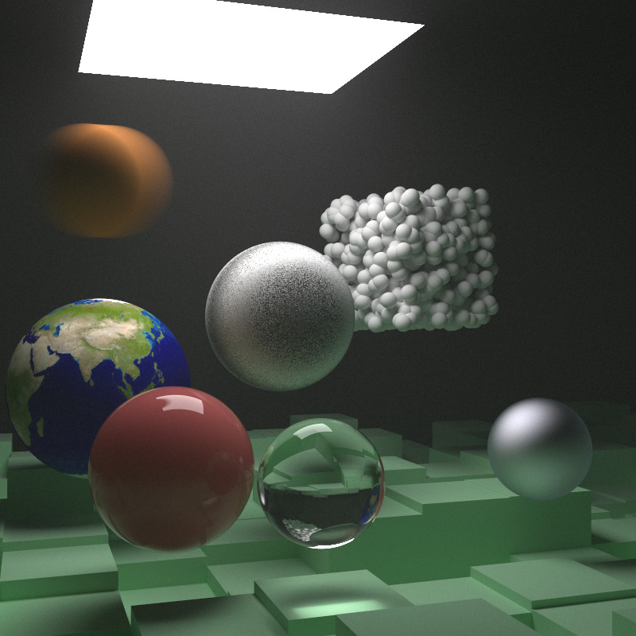

# RayTracing: rest of my life

By studying the famous 'RayTracing' series, I tried to write down my own ray tracing renderer, which currently supports following functions below:

- Path tracing using monto carlo integration
- materials rendering include:
  - lambertian material
  - perlin noise texture
  - image texture mapping
  - mixture densities material

## To-do list

- [ ] tidy my code
- [ ] path tracing optimization
- [ ] change the saving file from 'bpm' to 'png'
- [ ] change the input file by reading '.obj' file
- [ ] change the basic rendering unit to triangle and compare the performance

reference: [tiny renderer](https://github.com/ssloy/tinyrenderer), [nori](https://wjakob.github.io/nori-very-old/), PBRT 

Rendering results are as follows:

**RayTracingInOneWeekend final output with 500 spp**

**RayTracingInOneWeek final output with 20000 spp**

**RayTracing: Rest of your life with 10000 spp(also as a cornell box)**

**--finished--**